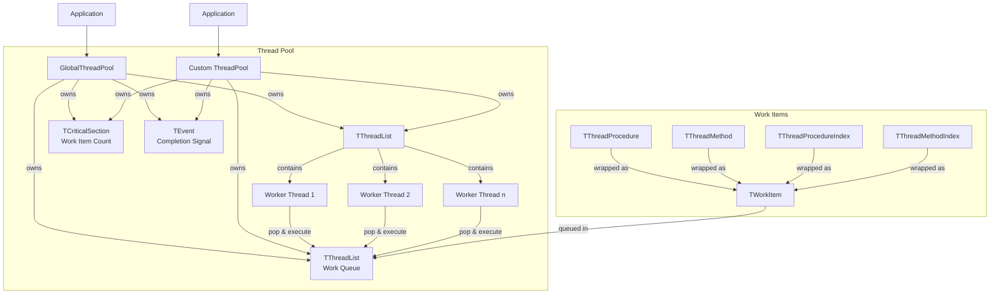

# ThreadPool-FP Technical Documentation

## Architecture Overview




## Core Components

### TThreadPool

Main thread pool manager that:

- Maintains worker threads using `TThreadList`
- Manages work item queue using `TThreadList`
- Tracks work item count with `TCriticalSection`
- Signals completion using `TEvent`
- Provides thread-safe queueing methods
- Handles shutdown and cleanup

### TWorkerThread

Worker thread implementation that:

- Inherits from `TThread`
- Runs suspended until explicitly started
- Continuously polls for work items
- Executes work items when available
- Sleeps when idle to prevent busy waiting
- Terminates cleanly on pool shutdown

### TWorkItem

Task wrapper that:

- Encapsulates four types of work:
  - Simple procedures (`TThreadProcedure`)
  - Object methods (`TThreadMethod`)
  - Indexed procedures (`TThreadProcedureIndex`)
  - Indexed methods (`TThreadMethodIndex`)
- Manages task execution
- Updates completion status


## Usage Patterns

### 1. Simple Procedure

```pascal
GlobalThreadPool.Queue(@SimpleProcedure);
```

### 2. Method of Object

```pascal
GlobalThreadPool.Queue(@SimpleProcedure);
```


### 3. Indexed Operations


```pascal
GlobalThreadPool.Queue(@ProcessItem, itemIndex);
```

## Example Implementation

See examples in the [examples](../examples) directory.

## Thread Safety

The implementation uses several synchronization mechanisms:

- `TThreadList` for thread and work item collections
- `TCriticalSection` for work item count
- `TEvent` for completion signaling
- Thread-safe queue operations

## Performance Considerations

- Thread count is based on `TThread.ProcessorCount` (see [limitations](#system-processor-count-detection-limitations) below)
- Sleep(1) prevents busy waiting in worker threads
- Batch processing recommended for small tasks
- Consider task granularity to avoid overhead

## Thread Management

### Thread Count Safety

The thread pool implements several safety measures for thread count:

1. **Minimum Threads**
   - Enforces minimum of 4 threads
   - Ensures basic parallel processing capability
   - Prevents ineffective thread pools

2. **Maximum Threads**
   - Limits to 2× ProcessorCount
   - Prevents system resource exhaustion
   - Scales reasonably with available processors

3. **Default Behavior**
   - Uses ProcessorCount when count ≤ 0
   - Automatically adjusts out-of-range values
   - Maintains safe operating parameters

### Thread Count Initialization

The default thread count uses `TThread.ProcessorCount`, but this has important limitations:

```pascal
constructor TThreadPool.Create(AThreadCount: Integer = 0);
begin
  // Safety limits:
  // - Minimum: 4 threads
  // - Maximum: 2× ProcessorCount
  // - Default: ProcessorCount (when ≤ 0)
  if AThreadCount <= 0 then
    AThreadCount := TThread.ProcessorCount
  else
    AThreadCount := Min(AThreadCount, TThread.ProcessorCount * 2);
  AThreadCount := Max(AThreadCount, 4);

  // -- other snippet

end;
```

### Implementation Notes

- Thread creation is managed in constructor
- All threads start suspended
- Explicit start after initialization
- Clean shutdown in destructor
- Thread-safe collections for management


### System Processor Count Detection Limitations

- `TThread.ProcessorCount` is set once at program start
- No guarantee whether it counts cores or CPUs
- May not reflect dynamic system changes
- Should be treated as approximate guidance only

### Performance Considerations
1. **Sleep Prevention**: Worker threads use `Sleep(1)` when idle
2. **Task Granularity**: Consider overhead vs task size
3. **Thread Count**: Default uses system processor count
4. **Shutdown**: Clean termination of all threads
5. **Resource Management**: Proper cleanup in destructor

## Exception Handling

The thread pool implements a robust exception handling system:

### Error Capture
- Worker threads catch all exceptions
- Error messages are stored thread-safely
- Thread ID is included in error messages
- Last error is accessible via `LastError` property

### Implementation Details

```pascal
// Worker thread exception handling
try
  WorkItem.Execute;
except
  on E: Exception do
    // Thread-safe error capture
    ThreadPool.StoreError(Format('[Thread %d] %s', 
      [ThreadID, E.Message]));
end;
```

### Error Management

- Thread-safe error storage using critical sections
- Error state can be cleared via `ClearLastError`
- Pool continues operating after exceptions
- Each new error overwrites the previous one

### Best Practices

1. Check `LastError` after `WaitForAll`
2. Clear errors before reusing the pool
3. Consider logging persistent errors
4. Use thread IDs to track error sources

### Limitations
- Only stores most recent error
- No built-in error event handling
- No exception propagation to main thread
- No error queue implementation
