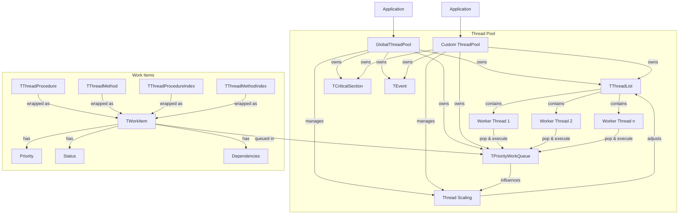
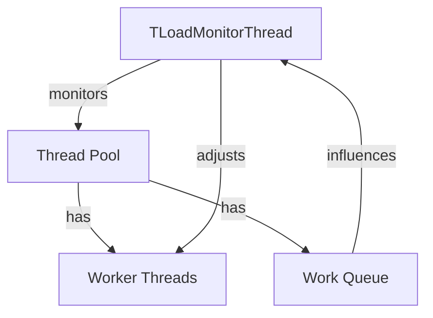

# ThreadPool-FP Technical Documentation

## Architecture Overview



## Core Components

### TThreadPool

Main thread pool manager that:

- Maintains dynamic worker thread count
- Manages priority-based work queue
- Handles task dependencies
- Implements automatic thread scaling
- Provides thread-safe operations
- Supports task prioritization

### TPriorityWorkQueue

Priority-based queue that:

- Maintains separate queues for each priority level
- Ensures higher priority tasks execute first
- Handles task dependencies
- Provides thread-safe operations

### TWorkItem

Enhanced task wrapper that:

- Encapsulates different types of work
- Tracks task status and dependencies
- Supports task priorities
- Manages execution state
- Handles error reporting

## Dynamic Thread Scaling

### Load Monitor Thread



The thread pool implements dynamic scaling through a dedicated monitoring thread:

```pascal
TLoadMonitorThread = class(TThread)
private
  FThreadPool: TThreadPool;
protected
  procedure Execute; override;
public
  constructor Create(AThreadPool: TThreadPool);
end;
```

### Scaling Algorithm

```pascal
function TThreadPool.CalculateOptimalThreadCount: Integer;
var
  QueueLength: Integer;
  ProcessorCount: Integer;
  UtilizationRate: Double;
begin
  // Get current queue length
  QueueLength := FWorkItemCount;
  
  // Calculate utilization rate (tasks per thread)
  UtilizationRate := QueueLength / FThreadCount;
  
  if UtilizationRate > FTargetQueueLength then
    // Need more threads
    Result := Min(FMaxThreads, Max(FMinThreads,
      Min(ProcessorCount * 2, QueueLength div FTargetQueueLength)))
  else if UtilizationRate < (FTargetQueueLength div 2) then
    // Can reduce threads
    Result := Max(FMinThreads, QueueLength div FTargetQueueLength)
  else
    // Current count is good
    Result := FThreadCount;
end;
```

### Scaling Parameters

1. **Thread Count Limits**
   - MinThreads: Minimum number of threads (default: max(4, CPU count))
   - MaxThreads: Maximum number of threads (default: CPU count × 2)
   - Current thread count must stay within these limits

2. **Monitoring Parameters**
   - LoadCheckInterval: Milliseconds between checks
   - TargetQueueLength: Ideal number of tasks per thread
   - UtilizationRate: Current tasks per thread

3. **Scaling Triggers**
   - Scale Up: UtilizationRate > TargetQueueLength
   - Scale Down: UtilizationRate < (TargetQueueLength ÷ 2)
   - No Change: Within optimal range

### Thread Safety in Scaling

The scaling mechanism implements several safety measures:

1. **Synchronized Thread List Access**
```pascal
ThreadList := FThreads.LockList;
try
  // Thread list modifications
finally
  FThreads.UnlockList;
end;
```

2. **Interval-Based Checks**
```pascal
if MilliSecondsBetween(Now, FLastLoadCheck) < FLoadCheckInterval then
  Exit;
```

3. **Safe Thread Addition/Removal**
```pascal
procedure TThreadPool.AddWorkerThread;
begin
  Thread := TWorkerThread.Create(Self);
  FThreads.Add(Thread);
  Thread.Start;
  Inc(FThreadCount);
end;
```

### Performance Considerations

1. **Monitor Thread Overhead**
   - Dedicated thread for monitoring
   - Configurable check interval
   - Minimal impact on worker threads

2. **Scaling Overhead**
   - Thread creation/destruction costs
   - Lock contention during scaling
   - Memory usage per thread

3. **Optimization Tips**
   - Adjust LoadCheckInterval based on workload patterns
   - Set appropriate MinThreads/MaxThreads for your use case
   - Consider task granularity when setting TargetQueueLength

## Task Priority System

### Priority Levels

```pascal
type
  TTaskPriority = (
    tpLow,      // Background tasks
    tpNormal,   // Default priority
    tpHigh,     // Important tasks
    tpCritical  // Urgent tasks
  );
```

### Task Status Tracking

```pascal
type
  TTaskStatus = (
    tsQueued,     // Task is queued
    tsExecuting,  // Currently executing
    tsCompleted,  // Completed successfully
    tsFailed      // Failed with error
  );
```

## Thread Safety Mechanisms

1. **Priority Queue**
   - Separate thread-safe queues per priority
   - Lock-protected queue operations
   - Atomic priority-based dequeuing

2. **Thread Management**
   - Thread-safe thread list operations
   - Synchronized thread count adjustments
   - Protected thread scaling calculations

3. **Task Management**
   - Thread-safe task status updates
   - Protected dependency checking
   - Synchronized error handling

## Performance Optimizations

1. **Dynamic Scaling**
   - Adapts to workload changes
   - Prevents thread overhead
   - Optimizes resource usage

2. **Priority Processing**
   - Ensures critical tasks execute first
   - Maintains responsiveness
   - Balances resource allocation

3. **Dependency Management**
   - Prevents unnecessary task execution
   - Optimizes task ordering
   - Reduces resource waste

## Implementation Notes

### Thread Pool Creation
```pascal
constructor TThreadPool.Create(AThreadCount: Integer = 0);
begin
  // Initialize with dynamic scaling support
  FMinThreads := Max(4, TThread.ProcessorCount);
  FMaxThreads := TThread.ProcessorCount * 2;
  FLoadCheckInterval := 1000;
  FTargetQueueLength := 4;
  // ... rest of initialization
end;
```

### Worker Thread Execution
```pascal
procedure TWorkerThread.Execute;
begin
  while not Terminated do
  begin
    // Check for thread scaling
    Pool.AdjustThreadCount;
    
    // Get next task respecting priorities
    WorkItem := Pool.FWorkQueue.Dequeue;
    
    if WorkItem <> nil then
      ExecuteTask(WorkItem)
    else
      Sleep(1);
  end;
end;
```

## Limitations and Considerations

1. **Scaling Limitations**
   - Minimum 4 threads enforced
   - Maximum limited by processor count
   - Scaling checks have overhead

2. **Priority Considerations**
   - Priority inversion possible
   - Starvation of low-priority tasks
   - Priority queue lock contention

3. **Dependencies**
   - Circular dependencies not detected
   - Complex dependencies impact performance
   - Memory overhead for dependency tracking

4. **Resource Usage**
   - Memory per thread
   - Lock contention at high loads
   - Queue memory overhead
