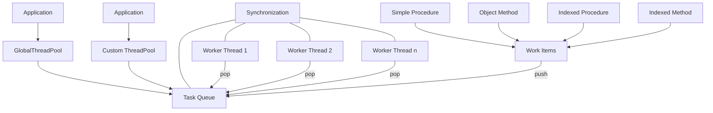

# ThreadPool-FP Technical Documentation

## Architecture Overview





## Core Components

### TThreadPool

Main thread pool manager that:

- Maintains worker threads
- Manages task queue
- Handles task distribution

### TWorkerThread

Worker thread implementation that:

- Continuously monitors for tasks
- Executes assigned work items
- Handles thread lifecycle


### TWorkItem

Task wrapper that:

- Encapsulates different types of work
- Handles task execution
- Manages task completion


## Usage Patterns

### 1. Simple Procedure

```pascal
GlobalThreadPool.Queue(@SimpleProcedure);
```

### 2. Method of Object

```pascal
GlobalThreadPool.Queue(@SimpleProcedure);
```


### 3. Indexed Operations


```pascal
GlobalThreadPool.Queue(@ProcessItem, itemIndex);
```

## Example Implementation

See examples in the [examples](../examples) directory.

## Thread Safety

- Task queue is protected by `TThreadList`
- Work item count uses `TCriticalSection`
- Task completion event for synchronization

## Performance Considerations

- Thread count is based on `TThread.ProcessorCount` (see [limitations](#system-processor-count-detection-limitations) below)
- Sleep(1) prevents busy waiting in worker threads
- Batch processing recommended for small tasks
- Consider task granularity to avoid overhead

## Thread Management

### Thread Count Initialization

The default thread count uses `TThread.ProcessorCount`, but this has important limitations:

```pascal
constructor TThreadPool.Create(AThreadCount: Integer = 0);
begin
  inherited Create;
  
  // Note: ProcessorCount limitations:
  // - May be cores or CPUs (unspecified)
  // - Set at program start
  // - May not reflect runtime changes
  if AThreadCount <= 0 then
    AThreadCount := TThread.ProcessorCount;
    
  FThreadCount := AThreadCount;
end;
```

### System Processor Count Detection Limitations

- `TThread.ProcessorCount` is set once at program start
- No guarantee whether it counts cores or CPUs
- May not reflect dynamic system changes
- Should be treated as approximate guidance only

### Performance Tips
1. **Task Size**: Ensure tasks are large enough to justify threading overhead
2. **Batch Processing**: Group small tasks together
3. **Resource Contention**: Minimize shared resource access
4. **Testing**: Benchmark with different thread counts for your specific use case
