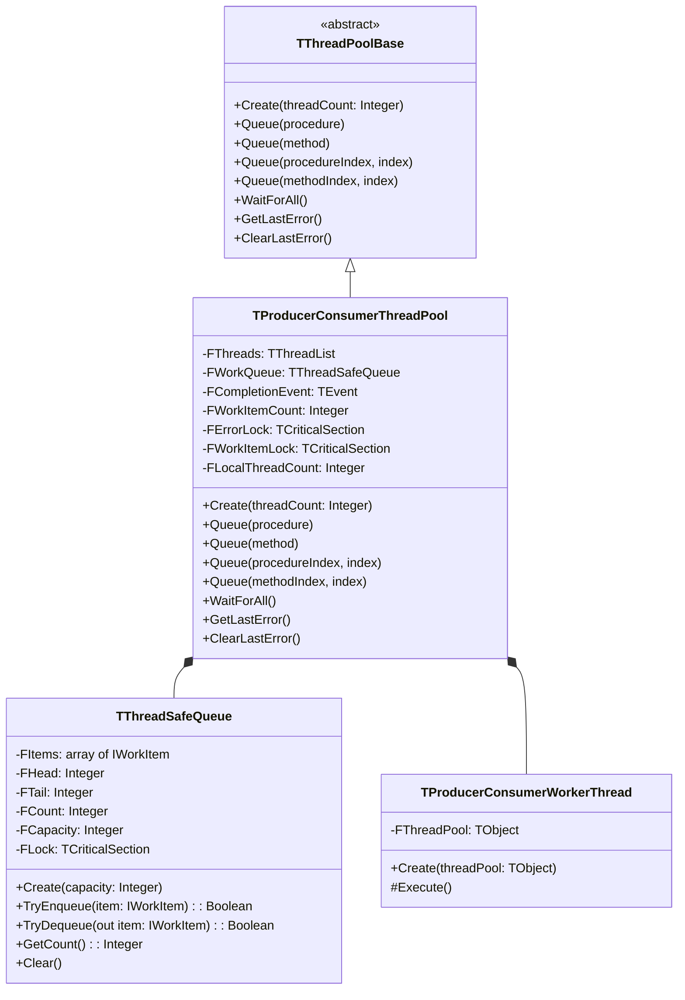
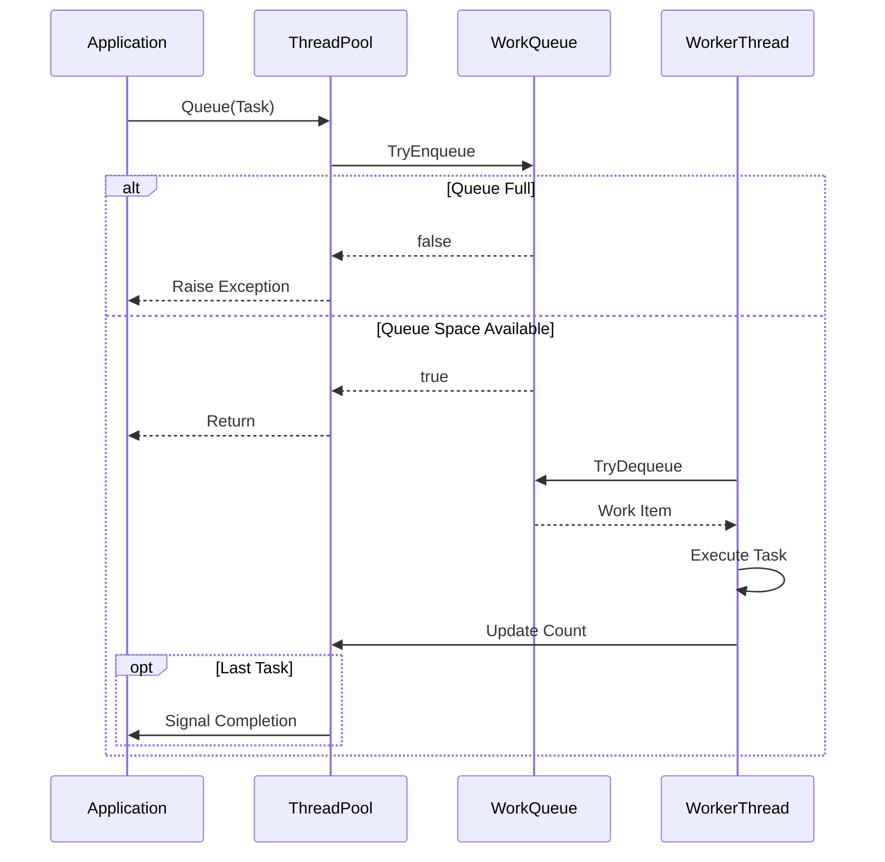
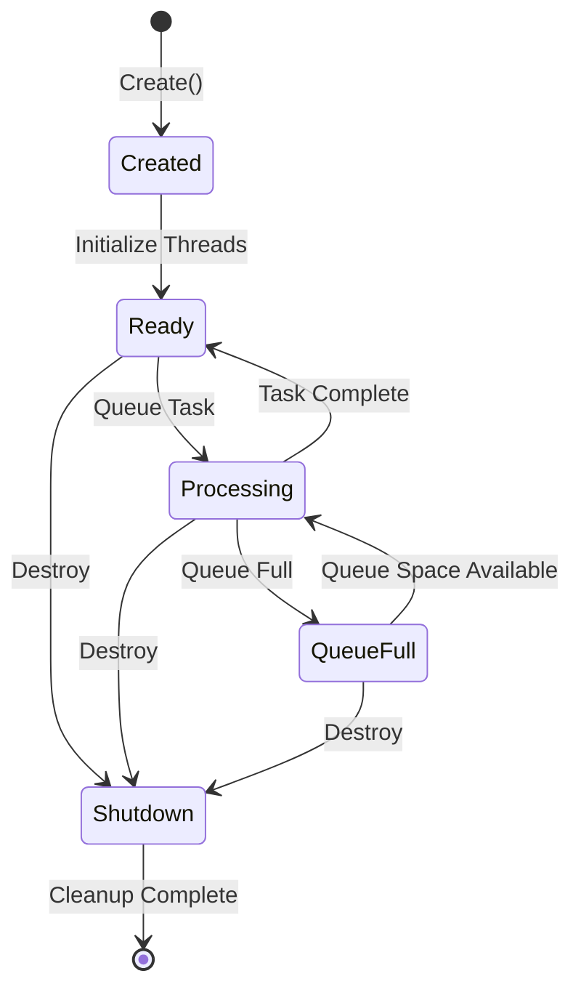
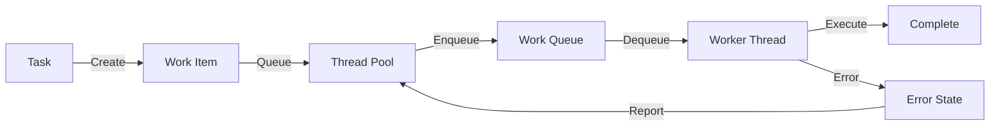

# ThreadPool.ProducerConsumer Technical

## Overview
The `ThreadPool.ProducerConsumer` unit implements a thread pool using the producer-consumer pattern with advanced backpressure handling. It provides a thread-safe queue for work items and manages a pool of worker threads that process these items.

### Key Features

1. **Backpressure Management**
   - Configurable load thresholds and delays
   - Default thresholds:
     - Low Load: 50% (0.5)
     - Medium Load: 70% (0.7)
     - High Load: 90% (0.9)
   - Default delays:
     - Low Load: 10ms
     - Medium Load: 50ms
     - High Load: 100ms
   - Maximum retry attempts: 5

2. **Debug Logging**
   - Enabled by default (DEBUG_LOG = True)
   - Includes timestamps and thread IDs
   - Logs queue operations and thread activities
   - Helps in monitoring and debugging

3. **Enhanced Error Handling**
   - New `EQueueFullException` for queue saturation
   - Detailed error messages with queue state
   - Thread-safe error reporting
   - Proper exception propagation

### Queue Management Strategy

The implementation uses a fixed-size circular buffer with backpressure:
- **Bounded Queue:** Fixed capacity of 1024 items prevents memory exhaustion
- **Load Monitoring:** Continuous tracking of queue load factor
- **Adaptive Delays:** Response times adjust based on queue load
- **Fail-Fast Policy:** Throws EQueueFullException after max attempts

### Producer-Consumer Thread Pool Details

The **Producer-Consumer Thread Pool** utilizes a fixed-size circular buffer combined with backpressure and retry mechanisms:

- **Fixed-Size Circular Buffer**
  - **Capacity:** The task queue is limited to 1024 items to ensure predictable memory usage.
  - **Circular Nature:** Efficiently reuses buffer space without the need for dynamic resizing.

- **Built-in Retry Mechanism**
  - **Automatic Retries:** When queue is full, the system will automatically retry up to 5 times (configurable)
  - **Backpressure Delays:** Each retry attempt includes adaptive delays based on queue load
  - **Exception Handling:** Throws EQueueFullException after maximum attempts are exhausted

> [!WARNING]
> 
> While the system includes automatic retry mechanisms, it's recommended that users implement their own error handling strategies for scenarios where the queue remains full after all retry attempts.

## Architecture

### Class Structure


### Component Interaction


### Thread Pool States


### Work Item Flow


## Key Components

### TProducerConsumerThreadPool
- Main thread pool implementation
- Manages worker threads and work queue
- Handles task queueing and completion tracking
- Thread count defaults to CPU count if not specified
- Thread-safe operation using critical sections

### TThreadSafeQueue
- Thread-safe circular queue implementation
- Fixed capacity (1024 items)
- Provides TryEnqueue and TryDequeue operations
- Handles queue full/empty conditions
- Uses critical section for thread safety
- Implements backpressure mechanism
- Monitors queue load factor

### TProducerConsumerWorkerThread
- Worker thread implementation
- Continuously processes items from queue
- Handles work item execution and error reporting
- Sleeps when queue is empty (100ms intervals)
- Created suspended, started explicitly

## Thread Safety
- Uses critical sections for queue operations (FLock)
- Uses critical sections for work item count (FWorkItemLock)
- Uses critical sections for error handling (FErrorLock)
- Uses event object for completion signaling (FCompletionEvent)
- Thread-safe backpressure application

## Error Handling
- Queue full conditions trigger retry mechanism
- Maximum retry attempts (default: 5)
- EQueueFullException raised after max retries
- Work item execution errors are captured and stored
- Thread termination is handled gracefully
- Last error accessible via LastError property

## Performance Considerations
- Fixed queue size (1024 items)
- Adaptive delays based on queue load
- Worker threads sleep 100ms when queue empty
- Thread count optimized for CPU count by default
- Thread-safe operations with minimal locking
- Backpressure helps prevent system overload

## Thread Management Details

### Thread Creation and Startup
- Threads created in suspended state
- Started explicitly after creation
- Thread count determined at startup
- No dynamic thread creation/destruction

### Thread Termination
- Graceful shutdown via Terminate flag
- Waits for threads to finish current task
- Proper cleanup of thread resources
- Thread-safe removal from thread list

### Thread State Management
```pascal
procedure TProducerConsumerWorkerThread.Execute;
begin
  while not Terminated do
  begin
    if TryGetWorkItem then
      ProcessWorkItem
    else
      Sleep(100);  // Prevent busy waiting
  end;
end;
```

## Exception Handling Implementation

### Worker Thread Exceptions
```pascal
try
  WorkItem.Execute;
except
  on E: Exception do
  begin
    Pool.FErrorLock.Enter;
    try
      Pool.SetLastError(E.Message);
    finally
      Pool.FErrorLock.Leave;
    end;
  end;
end;
```

### Queue Operation Exceptions
- Queue full detection via TryEnqueue
- Exception propagation to caller
- Work item count adjustment
- Completion event management

### Error State Management
- Thread-safe error storage
- Last error overwrite policy
- Error clearing mechanism
- Error retrieval synchronization

## Performance Details

### Queue Implementation Strategy

#### Current Approach
The implementation uses a fixed-size circular buffer with backpressure:
- **Bounded Queue:** Fixed capacity of 1024 items prevents memory exhaustion
- **Thread Safety:** All operations protected by FLock critical section
- **Backpressure Policy:** Adaptive delays based on queue load factor


```pascal
function TThreadSafeQueue.TryEnqueue(AItem: IWorkItem): boolean;
begin
  Result := False;
  FLock.Enter;
  try
    if FCount < FCapacity then
    begin
      FItems[FTail] := AItem;
      FTail := (FTail + 1) mod FCapacity;
      Inc(FCount);
      Result := True;
    end;
  finally
    FLock.Leave;
  end;
end;
```


### Benefits of Current Strategy
1. **Memory Safety**
   - Predictable memory usage
   - No risk of unbounded growth
   - Protected against memory exhaustion

2. **Performance**
   - O(1) enqueue/dequeue operations
   - Minimal lock contention
   - No memory allocation during operation
   - Quick failure detection

3. **Reliability**
   - Clear failure semantics
   - Thread-safe operations
   - No hidden blocking
   - Predictable behavior under load

### Critical Section Usage
```pascal
type
  TThreadSafeQueue = class
  private
    FLock: TCriticalSection;
    // ...
  end;

procedure TThreadSafeQueue.TryEnqueue;
begin
  FLock.Enter;
  try
    // Minimal critical section scope
  finally
    FLock.Leave;
  end;
end;
```

### Memory Management
- Pre-allocated queue buffer
- No dynamic resizing
- Work item reference counting
- Proper interface cleanup

### Thread Synchronization
- Event-based completion signaling
- Sleep-based idle management
- Multiple critical sections for different concerns
- Minimal lock scope

## Implementation Limitations

### Queue Constraints
1. **Fixed Capacity**
   - 1024 items maximum
   - No dynamic growth
   - Blocking on full
   - No priority support

2. **Performance Impact**
   - Memory pre-allocation
   - Potential queue saturation
   - Sleep delay overhead
   - Lock contention possible

### Thread Management Limitations
1. **Static Threading**
   - Fixed thread count
   - No dynamic scaling
   - No thread pool resizing
   - No thread priority control

2. **Resource Usage**
   - Memory for queue buffer
   - Thread stack allocation
   - Critical section overhead
   - Event object overhead

### Error Handling Limitations
1. **Error Storage**
   - Single error message
   - Last error overwrites
   - No error history
   - No error categorization

2. **Exception Management**
   - Limited error propagation
   - No error event system
   - No error recovery mechanism
   - No error filtering

## Resource Management

### Cleanup Sequence
```pascal
destructor TProducerConsumerThreadPool.Destroy;
begin
  ClearThreads;        // Stop and free threads
  FWorkQueue.Free;     // Free queue and items
  FCompletionEvent.Free;
  FErrorLock.Free;
  FWorkItemLock.Free;
  FThreads.Free;
  inherited;
end;
```

### Resource Lifetime
- Thread termination before cleanup
- Work item completion handling
- Critical section disposal
- Event object cleanup

### Memory Considerations
- Queue buffer allocation
- Thread stack allocation
- Work item interface references
- Synchronization object overhead

