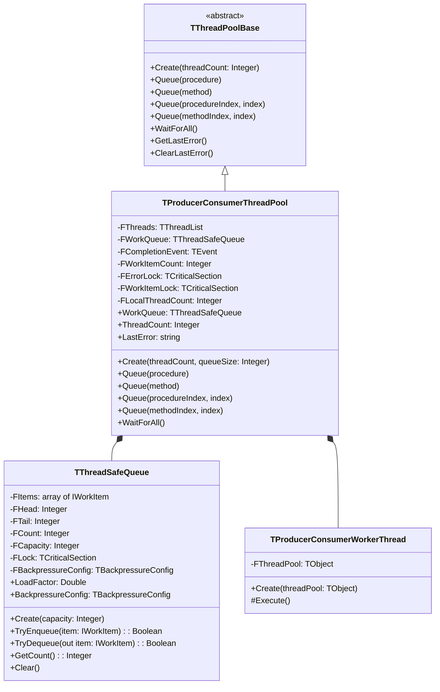
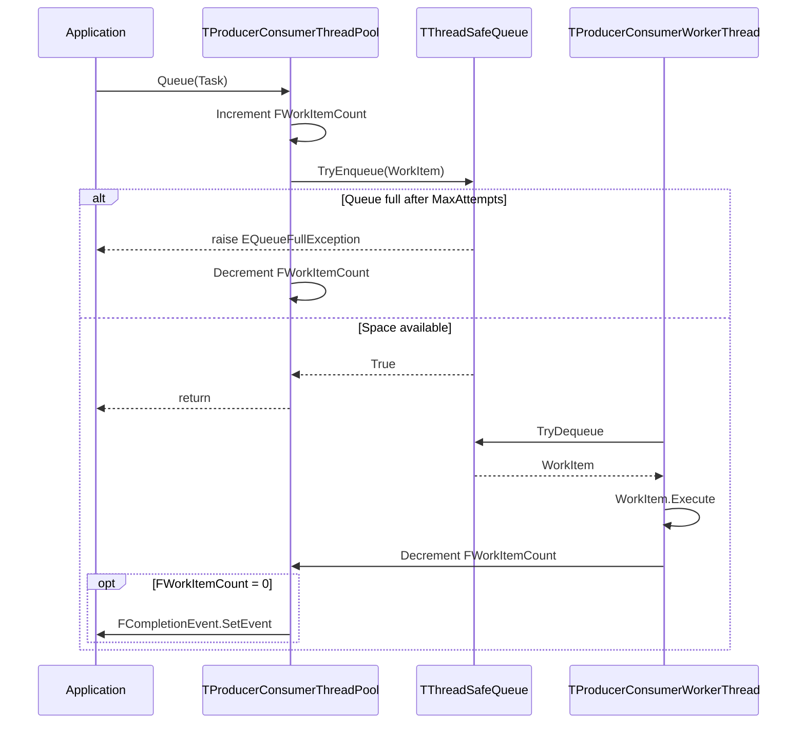
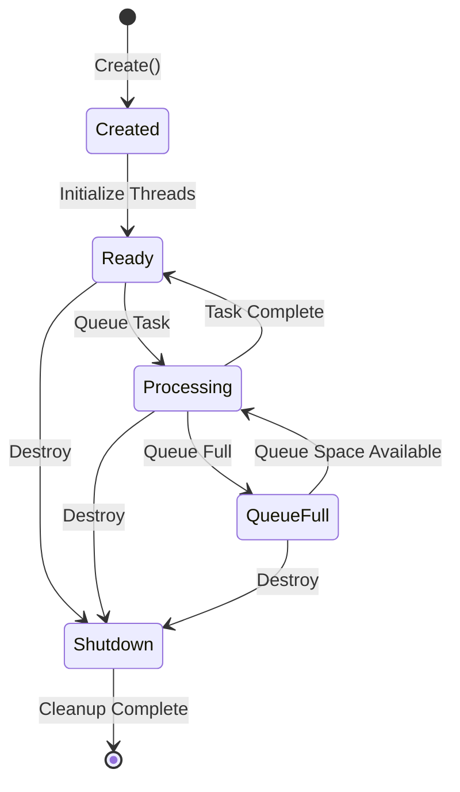
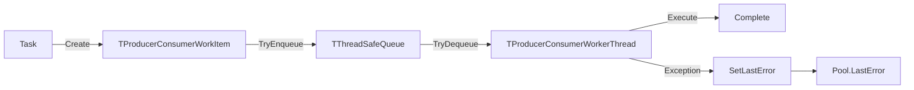

# ThreadPool.ProducerConsumer — Technical Documentation

## Overview

`ThreadPool.ProducerConsumer` implements a thread pool using the
producer-consumer pattern. Tasks are placed into a fixed-size circular buffer by
the caller (producer) and removed for execution by worker threads (consumers).
When the buffer fills faster than workers can drain it, adaptive backpressure
slows the producer before raising `EQueueFullException`.

---

## Architecture

### Class Structure


```mermaid
classDiagram
    class TThreadPoolBase {
        <<abstract>>
        +Create(threadCount: Integer)
        +Queue(procedure)
        +Queue(method)
        +Queue(procedureIndex, index)
        +Queue(methodIndex, index)
        +WaitForAll()
        +GetLastError()
        +ClearLastError()
    }

    class TProducerConsumerThreadPool {
        -FThreads: TThreadList
        -FWorkQueue: TThreadSafeQueue
        -FCompletionEvent: TEvent
        -FWorkItemCount: Integer
        -FErrorLock: TCriticalSection
        -FWorkItemLock: TCriticalSection
        -FLocalThreadCount: Integer
        +Create(threadCount, queueSize: Integer)
        +Queue(procedure)
        +Queue(method)
        +Queue(procedureIndex, index)
        +Queue(methodIndex, index)
        +WaitForAll()
        +WorkQueue: TThreadSafeQueue
        +ThreadCount: Integer
        +LastError: string
    }

    class TThreadSafeQueue {
        -FItems: array of IWorkItem
        -FHead: Integer
        -FTail: Integer
        -FCount: Integer
        -FCapacity: Integer
        -FLock: TCriticalSection
        -FBackpressureConfig: TBackpressureConfig
        +Create(capacity: Integer)
        +TryEnqueue(item: IWorkItem): Boolean
        +TryDequeue(out item: IWorkItem): Boolean
        +GetCount(): Integer
        +LoadFactor: Double
        +BackpressureConfig: TBackpressureConfig
        +Clear()
    }

    class TProducerConsumerWorkerThread {
        -FThreadPool: TObject
        +Create(threadPool: TObject)
        #Execute()
    }

    TThreadPoolBase <|-- TProducerConsumerThreadPool
    TProducerConsumerThreadPool *-- TThreadSafeQueue
    TProducerConsumerThreadPool *-- TProducerConsumerWorkerThread
```

### Component Interaction


```mermaid
sequenceDiagram
    participant App as Application
    participant Pool as TProducerConsumerThreadPool
    participant Queue as TThreadSafeQueue
    participant Worker as TProducerConsumerWorkerThread

    App->>Pool: Queue(Task)
    Pool->>Pool: Increment FWorkItemCount
    Pool->>Queue: TryEnqueue(WorkItem)
    alt Queue full after MaxAttempts
        Queue-->>App: raise EQueueFullException
        Pool->>Pool: Decrement FWorkItemCount
    else Space available
        Queue-->>Pool: True
        Pool-->>App: return
        Worker->>Queue: TryDequeue
        Queue-->>Worker: WorkItem
        Worker->>Worker: WorkItem.Execute
        Worker->>Pool: Decrement FWorkItemCount
        opt FWorkItemCount = 0
            Pool->>App: FCompletionEvent.SetEvent
        end
    end
```

### Thread Pool States


```mermaid
stateDiagram-v2
    [*] --> Created: Create()
    Created --> Ready: Initialize Threads
    Ready --> Processing: Queue Task
    Processing --> Ready: Task Complete
    Processing --> QueueFull: Queue Full
    QueueFull --> Processing: Queue Space Available
    Ready --> Shutdown: Destroy
    Processing --> Shutdown: Destroy
    QueueFull --> Shutdown: Destroy
    Shutdown --> [*]: Cleanup Complete
```

### Work Item Flow


```mermaid
flowchart LR
    A[Task] -->|Create| B[TProducerConsumerWorkItem]
    B -->|TryEnqueue| C[TThreadSafeQueue]
    C -->|TryDequeue| D[TProducerConsumerWorkerThread]
    D -->|Execute| E[Complete]
    D -->|Exception| F[SetLastError]
    F --> G[Pool.LastError]
```

---

## Key Components

### TProducerConsumerThreadPool

The main class. It:

- Creates and starts all worker threads at construction time
- Wraps each `Queue` call into a `TProducerConsumerWorkItem` and passes it to `TThreadSafeQueue.TryEnqueue`
- Tracks the number of in-flight work items (`FWorkItemCount`) under `FWorkItemLock`
- Signals `FCompletionEvent` when `FWorkItemCount` reaches zero (satisfying `WaitForAll`)
- Stores the most recent worker exception message in `FLastError` under `FErrorLock`

### TThreadSafeQueue

A thread-safe circular buffer. Key properties:

- **Capacity** is fixed at construction — no dynamic resizing
- **Head/tail pointers** wrap around modulo capacity: O(1) enqueue and dequeue
- `LoadFactor` = `FCount / FCapacity` — used by backpressure logic
- All operations are protected by a single `TCriticalSection` (`FLock`)

### TProducerConsumerWorkerThread

Each worker:

- Loops calling `TryDequeue`; executes the work item if one is available
- Calls `Sleep(100)` when the queue is empty to avoid busy-waiting
- On exception inside `Execute`, stores the message in `Pool.FLastError` and
  decrements the work item counter normally (pool keeps running)
- Exits the loop when `Terminated` is set during pool destruction

---

## Backpressure

Before each enqueue attempt, `ApplyBackpressure` reads `LoadFactor` and sleeps
for a configurable duration:

| Load factor | Default delay |
| --- | --- |
| ≥ 50% (`LowLoadThreshold`) | 10 ms |
| ≥ 70% (`MediumLoadThreshold`) | 50 ms |
| ≥ 90% (`HighLoadThreshold`) | 100 ms |

After `MaxAttempts` (default 5) failures, `EQueueFullException` is raised.

Configure via `Pool.WorkQueue.BackpressureConfig`:

```pascal
var
  Config: TBackpressureConfig;
begin
  Config := Pool.WorkQueue.BackpressureConfig;
  Config.MaxAttempts   := 3;
  Config.HighLoadDelay := 200;
  Pool.WorkQueue.BackpressureConfig := Config;
end;
```

---

## Implementation Details

### TryEnqueue — full implementation

```pascal
function TThreadSafeQueue.TryEnqueue(AItem: IWorkItem): boolean;
var
  Attempts: Integer;
begin
  if AItem = nil then Exit(False);

  Attempts := 0;
  while Attempts < FBackpressureConfig.MaxAttempts do
  begin
    ApplyBackpressure;  // adaptive delay based on current LoadFactor

    FLock.Enter;
    try
      if FCount < FCapacity then
      begin
        FItems[FTail] := AItem;
        FTail := (FTail + 1) mod FCapacity;
        Inc(FCount);
        FLastEnqueueTime := Now;
        Exit(True);  // success
      end;
    finally
      FLock.Leave;
    end;

    Inc(Attempts);
    if Attempts < FBackpressureConfig.MaxAttempts then
      Sleep(10);
  end;

  // All attempts exhausted
  raise EQueueFullException.Create(Format(
    'Queue is full after %d attempts (Capacity: %d)',
    [FBackpressureConfig.MaxAttempts, FCapacity]));
end;
```

### Worker Execute loop

```pascal
procedure TProducerConsumerWorkerThread.Execute;
var
  Pool: TProducerConsumerThreadPool;
  WorkItem: IWorkItem;
begin
  Pool := TProducerConsumerThreadPool(FThreadPool);

  while not Terminated do
  begin
    if Pool.FWorkQueue.TryDequeue(WorkItem) then
    begin
      try
        WorkItem.Execute;
      except
        on E: Exception do
        begin
          Pool.FErrorLock.Enter;
          try
            Pool.SetLastError(E.Message);
          finally
            Pool.FErrorLock.Leave;
          end;
        end;
      end;

      // Decrement counter; signal WaitForAll when last item finishes
      Pool.FWorkItemLock.Enter;
      try
        Dec(Pool.FWorkItemCount);
        if Pool.FWorkItemCount = 0 then
          Pool.FCompletionEvent.SetEvent;
      finally
        Pool.FWorkItemLock.Leave;
      end;
    end
    else
      Sleep(100);  // queue empty — avoid busy-waiting
  end;
end;
```

### Destructor / cleanup sequence

```pascal
destructor TProducerConsumerThreadPool.Destroy;
begin
  ClearThreads;          // sets Terminated, waits for all threads, frees them
  FWorkQueue.Free;
  FCompletionEvent.Free;
  FErrorLock.Free;
  FWorkItemLock.Free;
  FThreads.Free;
  inherited;
end;
```

---

## Thread Safety Summary

| Object | Protects |
| --- | --- |
| `FLock` (in TThreadSafeQueue) | Queue head/tail/count during enqueue and dequeue |
| `FWorkItemLock` | `FWorkItemCount` and `FCompletionEvent` |
| `FErrorLock` | `FLastError` writes from worker threads |
| `FCompletionEvent` | Signals `WaitForAll` when all items are done |

---

## Performance Considerations

- **O(1)** enqueue and dequeue — circular buffer, no shifting
- Backpressure delays add latency on the producer side when the queue is busy;
  tune `MaxAttempts` and delay values for your workload
- Workers sleep **100 ms** when the queue is empty — acceptable for batch
  workloads, but not suitable for latency-sensitive tasks
- `DEBUG_LOG = True` by default; set it to `False` in production to eliminate
  the overhead of timestamped console output

---

## Limitations

- Fixed queue capacity — no dynamic resizing
- Only the most recent worker exception is stored (`LastError`)
- No task priority, ordering guarantees, or cancellation
- Thread count is fixed after construction — no dynamic scaling
- Debug logging writes to stdout; there is no log-level or handler API
