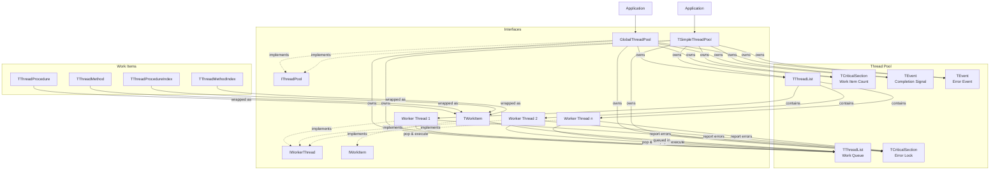

# ThreadPool-FP Technical Documentation

## Architecture Overview




## Core Components

### Thread Pool Types

1. **GlobalThreadPool**
   - Singleton instance for simple usage
   - Automatically initialized on first use
   - Uses default thread count based on `ProcessorCount`
   - Suitable for most applications
   - Thread-safe by design

2. **TSimpleThreadPool**
   - Custom instance creation with configurable thread count
   - Multiple independent pools possible
   - Full control over pool lifetime
   - Same thread safety guarantees as `GlobalThreadPool`
   - Useful for specialized threading scenarios

Both types share the same underlying implementation and provide identical thread safety guarantees and features. The main difference is in initialization and lifetime management.

### TSimpleThreadPool

Main thread pool manager that:

- Maintains worker threads using `TThreadList`
- Manages work item queue using `TThreadList`
- Tracks work item count with `TCriticalSection`
- Signals completion using `TEvent`
- Provides thread-safe queueing methods
- Handles shutdown and cleanup
- Implements comprehensive error handling
- Supports thread count configuration

### TWorkerThread

Worker thread implementation that:

- Inherits from `TThread`
- Runs suspended until explicitly started
- Continuously polls for work items
- Executes work items when available
- Sleeps when idle to prevent busy waiting
- Terminates cleanly on pool shutdown

### TWorkItem

Task wrapper that:

- Encapsulates four types of work:
  - Simple procedures (`TThreadProcedure`)
  - Object methods (`TThreadMethod`)
  - Indexed procedures (`TThreadProcedureIndex`)
  - Indexed methods (`TThreadMethodIndex`)
- Manages task execution
- Updates completion status


## Usage Patterns

### 1. Basic Operations

```pascal
// Queue a simple procedure
GlobalThreadPool.Queue(@SimpleProcedure);
// Queue a method
GlobalThreadPool.Queue(@MyObject.MyMethod);
// Queue with index
GlobalThreadPool.Queue(@ProcessItem, 5);
```

### 2. Error Handling

```pascal
try
  GlobalThreadPool.Queue(@MyProcedure);
  GlobalThreadPool.WaitForAll;
  if GlobalThreadPool.LastError <> '' then
    WriteLn('Error occurred: ', GlobalThreadPool.LastError);
finally
  GlobalThreadPool.Free;
end;
```

## Example Implementation

See examples in the [examples](../examples) directory.

## Thread Safety

The implementation uses several synchronization mechanisms:

- `TThreadList` for thread and work item collections
- `TCriticalSection` for work item count
- `TEvent` for completion signaling
- Thread-safe queue operations

## Performance Considerations

- Thread count is based on `TThread.ProcessorCount` (see [limitations](#system-processor-count-detection-limitations) below)
- Sleep(1) prevents busy waiting in worker threads
- Batch processing recommended for small tasks
- Consider task granularity to avoid overhead

## Thread Management

### Thread Count Rules
1. Minimum: 4 threads (enforced)
2. Maximum: 2× `ProcessorCount` (strictly enforced)
3. Default: `ProcessorCount` when count = 0 (verified by Test11_ThreadCount)
4. Auto-adjustment of invalid values:
   - Values < 4 are increased to 4
   - Values > 2× `ProcessorCount` are reduced
   - Zero defaults to `ProcessorCount`

### Performance Considerations
1. Efficient thread reuse (verified by stress tests)
2. Safe concurrent queue access
3. Protected counter operations
4. Clean exception handling
5. Proper resource cleanup


### System Processor Count Detection Limitations

- `TThread.ProcessorCount` is set once at program start
- No guarantee whether it counts cores or CPUs
- May not reflect dynamic system changes
- Should be treated as approximate guidance only

### Performance Considerations
1. **Sleep Prevention**: Worker threads use `Sleep(1)` when idle
2. **Task Granularity**: Consider overhead vs task size
3. **Thread Count**: Default uses system processor count
4. **Shutdown**: Clean termination of all threads
5. **Resource Management**: Proper cleanup in destructor

## Exception Handling

The thread pool implements a robust exception handling system:

### Error Capture
- Worker threads catch all exceptions
- Error messages are stored thread-safely
- Thread ID is included in error messages
- Last error is accessible via `LastError` property


### Error Management

- Thread-safe error storage using critical sections
- Error state can be cleared via `ClearLastError` (Test21_ExceptionAfterClear)
- Pool continues operating after exceptions (Test20_MultipleExceptions)
- Each new error overwrites the previous one
- Error messages include thread identification (Test19_ExceptionMessage)

### Best Practices

1. Check `LastError` after `WaitForAll`
2. Clear errors before reusing the pool
3. Consider logging persistent errors
4. Use thread IDs to track error sources


### Limitations
- Only the most recent error is stored
- No built-in mechanism for error event handling
- Exceptions are not propagated to the main thread
- No implementation of an error queue
