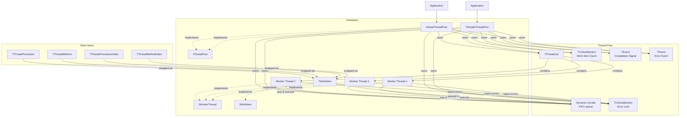

# ThreadPool.Simple — Technical Documentation

## Architecture Overview


```mermaid
graph TD
    A1[Application] --> G[GlobalThreadPool]
    A2[Application] --> S[TSimpleThreadPool]

    subgraph "Interfaces"
        ITP[IThreadPool]
        IWT[IWorkerThread]
        IWI[IWorkItem]

        G & S -.->|implements| ITP
        W1 & W2 & Wn -.->|implements| IWT
        WI -.->|implements| IWI
    end

    subgraph "Thread Pool"
        G & S --> |owns| TL[TThreadList]
        G & S --> |owns| WQ[Dynamic circular<br>FIFO queue]
        G & S --> |owns| CS[TCriticalSection<br>Work Item Count]
        G & S --> |owns| EV[TEvent<br>Completion Signal]
        G & S --> |owns| EL[TCriticalSection<br>Error Lock]
        G & S --> |owns| EE[TEvent<br>Error Event]

        TL --> |contains| W1[Worker Thread 1]
        TL --> |contains| W2[Worker Thread 2]
        TL --> |contains| Wn[Worker Thread n]

        W1 & W2 & Wn -->|pop & execute| WQ
        W1 & W2 & Wn -->|report errors| EL
    end

    subgraph "Work Items"
        P1[TThreadProcedure] --> |wrapped as| WI[TWorkItem]
        P2[TThreadMethod] --> |wrapped as| WI
        P3[TThreadProcedureIndex] --> |wrapped as| WI
        P4[TThreadMethodIndex] --> |wrapped as| WI
        WI -->|queued in| WQ
    end
```

---

## Core Components

### GlobalThreadPool

A singleton `TSimpleThreadPool` declared in the unit's `var` section.

- Created in the unit `initialization` block — available from program startup
- Freed in the unit `finalization` block — **never call `GlobalThreadPool.Free` manually**
- Thread count defaults to `TThread.ProcessorCount` (minimum 4)

### TSimpleThreadPool

The main pool class. Responsibilities:

- Owns and manages a list of `TSimpleWorkerThread` instances (`TThreadList`)
- Maintains a dynamically growing O(1) circular FIFO queue
- Tracks the number of pending work items with a `TCriticalSection` + counter
- Signals `WaitForAll` callers via a `TEvent` when the counter reaches zero
- Captures worker exceptions and protects lifecycle transitions

### TSimpleWorkerThread

Each worker thread:

- Is created suspended and started explicitly by the pool constructor
- Blocks on `FWorkAvailableEvent` while the queue is empty
- Drains available FIFO work after an enqueue wakes it
- Terminates cleanly when `Terminated` is set during pool destruction

### TSimpleWorkItem

A lightweight wrapper around one of the four task types:

| Type | Pascal type |
| --- | --- |
| Plain procedure | `TThreadProcedure` |
| Object method | `TThreadMethod` |
| Indexed procedure | `TThreadProcedureIndex` |
| Indexed method | `TThreadMethodIndex` |

On execution it calls the appropriate callable, then decrements the pool's pending
counter (and signals completion if it reaches zero).

---

## Thread Count Rules

| Condition | Result |
| --- | --- |
| `AThreadCount <= 0` | Uses `TThread.ProcessorCount` |
| `AThreadCount < 4` | Raised to 4 (minimum enforced) |
| `AThreadCount > 2 × ProcessorCount` | Clamped to `2 × ProcessorCount` |

Thread count is fixed after construction — there is no dynamic scaling.

### ProcessorCount limitations

- `TThread.ProcessorCount` is read once at program startup
- It may count logical CPUs (hyper-threads), not physical cores
- It does not reflect runtime changes (e.g. CPU affinity, power states)
- Treat it as approximate guidance, not a precise thread budget

---

## Usage Patterns

### 1. Basic queuing

```pascal
GlobalThreadPool.Queue(@SimpleProcedure);
GlobalThreadPool.Queue(@MyObject.MyMethod);
GlobalThreadPool.Queue(@ProcessItem, 5);
GlobalThreadPool.WaitForAll;
```

### 2. Error handling

```pascal
// GlobalThreadPool is managed by the unit — do NOT call Free on it.
GlobalThreadPool.Queue(@MyProcedure);
GlobalThreadPool.WaitForAll;

if GlobalThreadPool.LastError <> '' then
begin
  WriteLn('Error: ', GlobalThreadPool.LastError);
  GlobalThreadPool.ClearLastError;  // reset before reuse
end;
```

### 3. Custom pool

```pascal
var
  Pool: TSimpleThreadPool;
begin
  Pool := TSimpleThreadPool.Create(4);
  try
    Pool.Queue(@MyProcedure);
    Pool.WaitForAll;
  finally
    Pool.Free;
  end;
end;
```

---

## Thread Safety

| Mechanism | Purpose |
| --- | --- |
| `TThreadList` (threads) | Safe iteration and termination of worker threads |
| `TCriticalSection` (FIFO queue) | Safe O(1) enqueue / dequeue across threads |
| `TCriticalSection` (work item count) | Atomic increment/decrement of pending counter |
| `TEvent` (completion) | Signals `WaitForAll` when counter hits zero |
| `TEvent` (work available) | Wakes idle workers without polling |
| Lifecycle lock/events | Serialize admission, draining, and stopped state |
| Error lock | Protects `LastError`, `Errors`, and `OnError` |

---

## Exception Handling

### How worker exceptions are captured

Workers store the task error through `TThreadPoolBase.SetLastError`. Completion
accounting runs in a separate `finally` block, and exceptions raised by an
`OnError` handler are contained at the callback boundary.

### Key behaviours

- `LastError` stores the **raw exception message** — no thread ID prefix
- `LastError` keeps the most recent exception and `Errors` keeps the bounded history
- The pool **keeps running** after an exception — remaining tasks are processed
- Call `ClearLastError` before reusing a pool to reset error state
- Exceptions are **not re-raised** on the calling thread; check `LastError` after `WaitForAll`

### Best practices

1. Always check `LastError` after `WaitForAll`
2. Call `ClearLastError` before queuing a new batch if reusing the pool
3. Use `Errors` when a batch can contain more than one failure

---

## Performance Considerations

- Idle workers block on an event and are woken immediately by submission
- Queue insertion/removal is O(1); growth only occurs when the ring is full
- For very large numbers of tiny tasks, consider batching them into fewer, larger work items to reduce queue overhead
- Thread count defaults to `ProcessorCount`; raising it above that can hurt performance due to context-switching

---

## Lifecycle

The shared base state moves from `tpsAccepting` to `tpsDraining` to
`tpsStopped`. `Shutdown` stops admission, waits for submissions already in
progress, drains every accepted task, wakes and joins the workers, and publishes
the stopped state. It is idempotent. Queueing after draining begins raises
`EThreadPoolShutdown`, and a worker attempting to shut down its own pool is
rejected before it can wait on itself.

---

## Limitations

- Exceptions are not propagated to the main thread — must poll `LastError`
- Thread count is fixed after construction — no dynamic scaling
- No task prioritisation or forced cancellation of running callbacks; v0.9 can
  cancel pending submitted work
